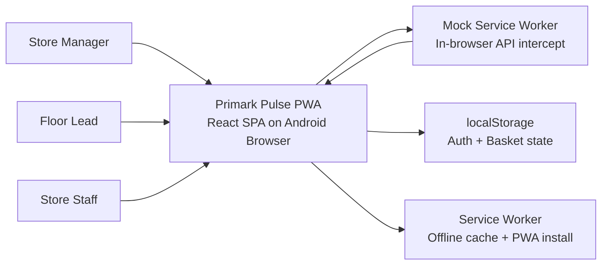
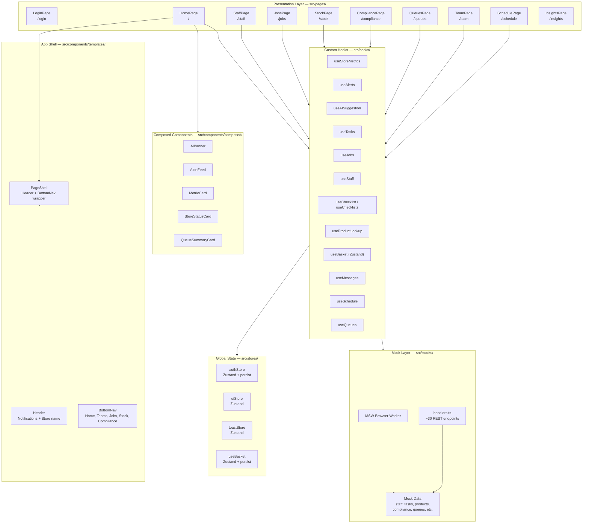
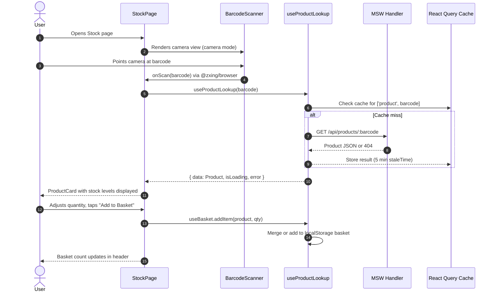
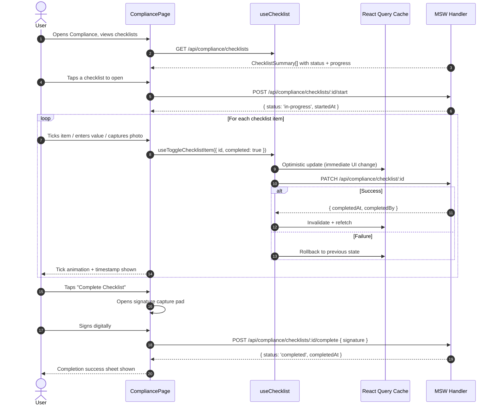

# Architecture — Primark Pulse.ai

**Version:** 1.0
**Date:** 2026-02-25
**Source:** Reverse-engineered from codebase

---

## 1. System Overview

Primark Pulse.ai is a **single-page application (SPA)** delivered as a **Progressive Web App (PWA)**. It is a fully client-side React application with no real backend — all API calls are intercepted by Mock Service Worker (MSW) during the Proof of Concept phase, returning mock data. The app is designed to run in-store on Android mobile devices and be installable from the browser.

---

## 2. Tech Stack

| Layer | Technology | Version |
|-------|-----------|---------|
| Frontend framework | React | 18.3.1 |
| Language | TypeScript | 5.4.3 |
| Build tool | Vite | 5.4.2 |
| Routing | React Router DOM | 6.22.3 |
| Server state | TanStack Query (React Query) | 5.28.4 |
| Global client state | Zustand | 4.5.2 |
| Styling | Tailwind CSS | 3.4.1 |
| UI components | Radix UI (shadcn/ui pattern) | Various |
| API mocking | Mock Service Worker (MSW) | 2.2.13 |
| PWA | vite-plugin-pwa (Workbox) | 0.19.7 |
| Barcode scanning | @zxing/browser | 0.1.5 |
| Offline storage | idb (IndexedDB) | 8.0.0 |
| Icons | Lucide React | 0.363.0 |
| Form validation | React Hook Form + Zod | 7.51.1 / 3.22.4 |

---

## 3. System Context Diagram

> Note: In production, MSW would be replaced by a real backend API. The service worker would continue to handle PWA install and offline caching.

---

## 4. Component Diagram

---

## 5. Key Modules

| Module | Location | Responsibility |
|--------|----------|----------------|
| App Router | `src/App.tsx` | Route definitions, protected route guard, lazy loading |
| App Bootstrap | `src/main.tsx` | React Query setup, MSW initialisation, React DOM mount |
| PageShell | `src/components/templates/PageShell/` | Header + BottomNav layout wrapper for all authenticated pages |
| BottomNav | `src/components/custom/bottom-nav.tsx` | Primary 5-item navigation bar (Home, Teams, Jobs, Stock, Compliance) |
| Auth Store | `src/stores/authStore.ts` | Zustand store; persists email, name, role, token to localStorage |
| UI Store | `src/stores/uiStore.ts` | Zustand store; active nav, notification count, toast, modal state |
| Basket Store | `src/hooks/useBasket.ts` | Zustand + persist; replenishment basket persisted to localStorage |
| Type Definitions | `src/types/index.ts` | All shared TypeScript interfaces and enums (~467 lines) |
| MSW Handlers | `src/mocks/handlers.ts` | ~30 MSW REST handlers covering all API endpoints |
| Mock Data | `src/mocks/data/` | Per-module typed mock data files |
| Home Page | `src/pages/Home/` | Live dashboard: metrics, AI banner, alerts, shift info |
| Jobs Page | `src/pages/Jobs/` | Job list, SLA timers, assignment, escalation |
| Stock Page | `src/pages/Stock/` | Barcode scan/manual entry, product lookup, basket, issue reporting |
| Compliance Page | `src/pages/Compliance/` | Enhanced checklists, policy search, incident reporting |
| Staff Page | `src/pages/Staff/` | Roster, zone filters, reallocation, staff detail |
| Team Page | `src/pages/Team/` | Enhanced messaging, acknowledgment tracking |
| Schedule Page | `src/pages/Schedule/` | Weekly shift view, shift swap requests |
| Queues Page | `src/pages/Queues/` | Queue monitoring, store pressure indicator |

---

## 6. Data Flow — Barcode Stock Lookup

---

## 7. Data Flow — Checklist Completion

---

## 8. Authentication and Authorisation

**Mechanism:** Custom email/password login with a mock JWT token. Any valid email and password is accepted in the PoC.

**Flow:**
1. User submits email + password on `/login`
2. `LoginPage` calls `setAuth(user, token)` on the Zustand `authStore`
3. Auth state (user, token, `isAuthenticated: true`) is persisted to `localStorage` under key `primark-pulse-auth`
4. All routes except `/login` are wrapped in `ProtectedRoute` (`src/App.tsx:22`) which redirects to `/login` if `isAuthenticated` is false

**Roles defined:** `staff` | `floor-lead` | `manager`

> Note: Role-based access control (RBAC) is declared in types but **not enforced** in routing or component logic in the PoC. All authenticated users have access to all pages.

---

## 9. Deployment and Infrastructure

**Build:** `tsc -b && vite build` compiles TypeScript and bundles via Vite with tree-shaking and code splitting.

**PWA Configuration** (`vite.config.ts`):
- `registerType: 'autoUpdate'` — service worker updates automatically in background
- `display: 'standalone'` — removes browser chrome; feels native on Android
- `theme_color: '#00758f'` — Primark teal in Android status bar
- `orientation: 'portrait'` — locked to portrait for in-store handheld use
- **Workbox runtime caching:** `NetworkFirst` strategy for `/api/*` URLs with 24-hour cache, 100-entry limit

**Dev server:** Runs on port 3000, accessible on all network interfaces (`host: true`) for mobile device testing on local network.

**Path aliases:** `@/` maps to `src/` for all imports.

**Hosting:** Not identifiable from codebase — no deployment config files present.
