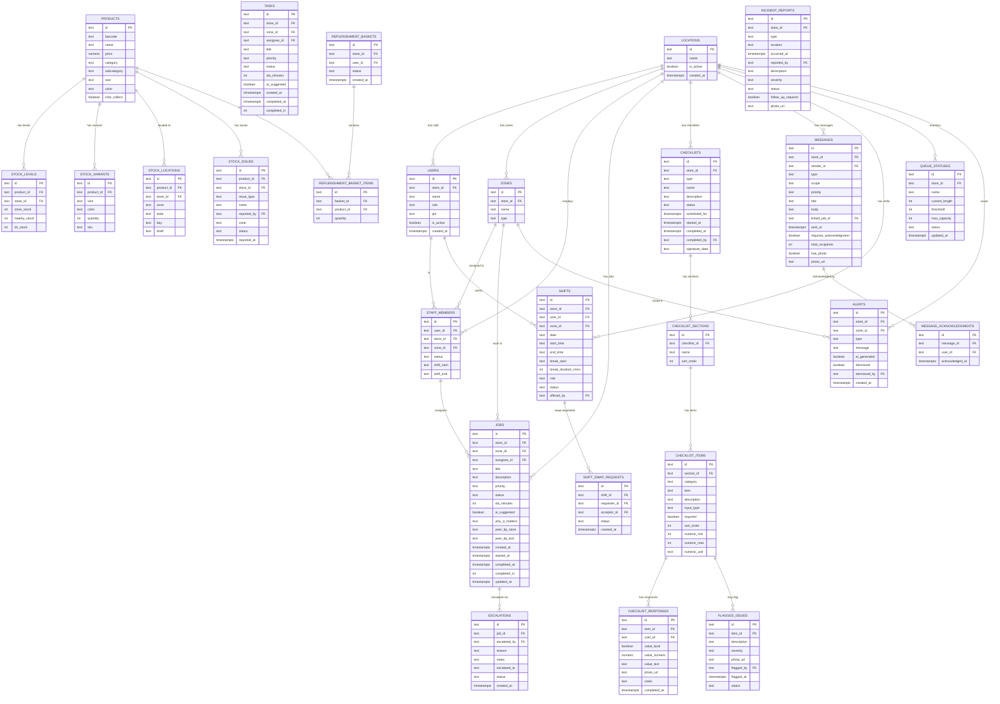

# Data Model — Primark Pulse

**Version:** 2.0
**Date:** 2026-02-27
**Source:** Reverse-engineered from `supabase/schema.sql` and `src/hooks/*.ts`

---

## 1. Entity Relationship Diagram

> The diagram below covers the core domain entities. Supporting tables (`store_metrics`, `ai_suggestions`, `notifications`, `store_pressure`) are described in section 2 but omitted from the ERD for clarity.

---

## 2. Entities

### LOCATIONS (stores)

**Table:** `locations`
**Description:** A physical Primark store location. Each user, staff member, job, shift, and checklist belongs to a location.

| Column | Type | Nullable | Description |
|--------|------|----------|-------------|
| `id` | text | No | Primary key (e.g., `store-manchester`) |
| `name` | text | No | Display name (e.g., "Manchester Arndale") |
| `is_active` | boolean | No | Whether this location is operational |
| `created_at` | timestamptz | No | Record creation timestamp |

---

### USERS

**Table:** `users`
**Description:** A store employee who can log in to Primark Pulse. Identity is verified by a 4-digit PIN. PIN is stored as plain text for PoC.

| Column | Type | Nullable | Description |
|--------|------|----------|-------------|
| `id` | text | No | Primary key |
| `store_id` | text | No | FK to `locations` |
| `name` | text | No | Display name |
| `role` | text | No | User role — see enumeration below |
| `pin` | text | No | 4-digit PIN (plain text in PoC) |
| `is_active` | boolean | No | Whether this user can log in |
| `created_at` | timestamptz | No | Record creation timestamp |

**Role values:** `staff` \| `floor-lead` \| `manager`

---

### ZONES

**Table:** `zones`
**Description:** A physical zone within a store (e.g., Womenswear, Stockroom, Fitting Rooms).

| Column | Type | Nullable | Description |
|--------|------|----------|-------------|
| `id` | text | No | Primary key |
| `store_id` | text | No | FK to `locations` |
| `name` | text | No | Zone display name |
| `type` | text | Yes | Zone category |

**Type values:** `floor` \| `stockroom` \| `tills` \| `fitting` \| `entrance`

---

### STAFF_MEMBERS

**Table:** `staff_members`
**Description:** A staff member's current roster entry, including their zone assignment, shift times, and availability status. A STAFF_MEMBER may or may not be linked to a `users` account.

| Column | Type | Nullable | Description |
|--------|------|----------|-------------|
| `id` | text | No | Primary key |
| `user_id` | text | Yes | FK to `users` (nullable for non-app staff) |
| `store_id` | text | No | FK to `locations` |
| `zone_id` | text | Yes | FK to `zones` — current zone assignment |
| `status` | text | No | Current availability |
| `shift_start` | text | Yes | Shift start time in HH:mm |
| `shift_end` | text | Yes | Shift end time in HH:mm |

**Status values:** `active` \| `break` \| `absent`

---

### JOBS

**Table:** `jobs`
**Description:** An operational task to be executed in-store. Jobs have SLA timers, priority levels, and can be escalated. The primary work entity visible to floor staff.

| Column | Type | Nullable | Description |
|--------|------|----------|-------------|
| `id` | text | No | Primary key |
| `store_id` | text | No | FK to `locations` |
| `zone_id` | text | Yes | FK to `zones` |
| `assignee_id` | text | Yes | FK to `staff_members` — null when unassigned |
| `title` | text | No | Job headline |
| `description` | text | Yes | Additional context |
| `priority` | text | No | Urgency level |
| `status` | text | No | Lifecycle state |
| `sla_minutes` | int | No | SLA target in minutes |
| `ai_suggested` | boolean | No | Whether AI-generated |
| `why_it_matters` | text | Yes | Human-focused context |
| `success_criteria` | text[] | Yes | Completion criteria |
| `peer_tip_store` | text | Yes | Store name providing a tip |
| `peer_tip_text` | text | Yes | Tip text from peer store |
| `created_at` | timestamptz | No | Creation timestamp |
| `started_at` | timestamptz | Yes | When staff started the job |
| `completed_at` | timestamptz | Yes | Completion timestamp |
| `completed_in` | int | Yes | Actual minutes taken |
| `updated_at` | timestamptz | Yes | Last updated timestamp |

**Priority values:** `CRITICAL` \| `HIGH` \| `MEDIUM` \| `LOW`

**Status values:** `unassigned` \| `pending` \| `in-progress` \| `complete` \| `escalated`

---

### ESCALATIONS

**Table:** `escalations`
**Description:** An escalation record attached to a job when a staff member cannot resolve it independently.

| Column | Type | Nullable | Description |
|--------|------|----------|-------------|
| `id` | text | No | Primary key |
| `job_id` | text | No | FK to `jobs` |
| `escalated_by` | text | Yes | FK to `users` |
| `reason` | text | No | Escalation reason |
| `notes` | text | Yes | Free-text notes |
| `escalated_to` | text | No | Escalation target |
| `status` | text | No | Escalation state |
| `created_at` | timestamptz | No | When escalation was filed |

**Reason values:** `cant-complete` \| `need-help` \| `equipment-issue` \| `stock-issue` \| `other`

**Escalated to values:** `store-manager` \| `regional-manager`

---

### TASKS

**Table:** `tasks`
**Description:** A simpler work item. Similar to Job but without peer tips, escalation, or contextual fields. Appears to be a legacy entity alongside the richer `jobs` entity; its page (`/tasks`) is not in the main navigation.

| Column | Type | Nullable | Description |
|--------|------|----------|-------------|
| `id` | text | No | Primary key |
| `store_id` | text | No | FK to `locations` |
| `zone_id` | text | Yes | FK to `zones` |
| `assignee_id` | text | Yes | FK to `staff_members` |
| `title` | text | No | Task headline |
| `priority` | text | No | Urgency level |
| `status` | text | No | Lifecycle state (no `escalated`) |
| `sla_minutes` | int | No | SLA target in minutes |
| `ai_suggested` | boolean | No | AI-generated flag |
| `created_at` | timestamptz | No | Creation timestamp |

---

### PRODUCTS

**Table:** `products`
**Description:** A retail product that can be looked up by barcode. Stock levels, variants, and floor location are stored in separate related tables.

| Column | Type | Nullable | Description |
|--------|------|----------|-------------|
| `id` | text | No | Primary key |
| `barcode` | text | No | EAN/UPC barcode (unique) |
| `name` | text | No | Product display name |
| `price` | numeric | No | Retail price in GBP |
| `category` | text | No | Top-level category |
| `subcategory` | text | Yes | Sub-category |
| `size` | text | Yes | Primary size variant |
| `color` | text | Yes | Primary colour variant |
| `click_collect` | boolean | No | Click & collect availability |

---

### STOCK_LEVELS

**Table:** `stock_levels`
**Description:** Store-specific stock availability for a product.

| Column | Type | Nullable | Description |
|--------|------|----------|-------------|
| `product_id` | text | No | FK to `products` |
| `store_id` | text | No | FK to `locations` |
| `store_stock` | int | No | Units in this store |
| `nearby_stock` | int | No | Units in nearby stores |
| `dc_stock` | int | No | Units at distribution centre |

---

### STOCK_VARIANTS

**Table:** `stock_variants`
**Description:** Individual size/colour combinations for a product with their own stock count.

| Column | Type | Nullable | Description |
|--------|------|----------|-------------|
| `product_id` | text | No | FK to `products` |
| `size` | text | No | Size (e.g., "M", "32W") |
| `color` | text | No | Colour |
| `quantity` | int | No | Units available |
| `sku` | text | No | SKU code |

---

### STOCK_LOCATIONS

**Table:** `stock_locations`
**Description:** Physical floor location of a product within a specific store.

| Column | Type | Nullable | Description |
|--------|------|----------|-------------|
| `product_id` | text | No | FK to `products` |
| `store_id` | text | No | FK to `locations` |
| `zone` | text | No | Zone name |
| `aisle` | text | No | Aisle label |
| `bay` | text | No | Bay number |
| `shelf` | text | Yes | Shelf level |

---

### STOCK_ISSUES

**Table:** `stock_issues`
**Description:** A reported stock discrepancy or damage report for a product.

| Column | Type | Nullable | Description |
|--------|------|----------|-------------|
| `id` | text | No | Primary key |
| `product_id` | text | Yes | FK to `products` |
| `store_id` | text | No | FK to `locations` |
| `issue_type` | text | No | Type of issue |
| `notes` | text | Yes | Free-text notes |
| `reported_by` | text | Yes | FK to `users` |
| `zone` | text | Yes | Where the issue was found |
| `status` | text | No | Resolution state |
| `reported_at` | timestamptz | No | When reported |

**Issue type values:** `wrong-location` \| `damaged` \| `count-mismatch` \| `missing-tag` \| `display-issue` \| `other`

**Status values:** `open` \| `acknowledged` \| `resolved`

---

### REPLENISHMENT_BASKETS / REPLENISHMENT_BASKET_ITEMS

**Tables:** `replenishment_baskets`, `replenishment_basket_items`
**Description:** A replenishment request basket created by a user, containing multiple product-quantity line items.

`replenishment_baskets`:

| Column | Type | Nullable | Description |
|--------|------|----------|-------------|
| `id` | text | No | Primary key |
| `store_id` | text | No | FK to `locations` |
| `user_id` | text | Yes | FK to `users` — who created it |
| `status` | text | No | Basket state (`open`, `submitted`) |
| `created_at` | timestamptz | No | Creation timestamp |

`replenishment_basket_items`:

| Column | Type | Nullable | Description |
|--------|------|----------|-------------|
| `id` | text | No | Primary key |
| `basket_id` | text | No | FK to `replenishment_baskets` |
| `product_id` | text | No | FK to `products` |
| `quantity` | int | No | Requested quantity |

> Note: The in-app basket state is managed client-side via Zustand + localStorage (`src/hooks/useBasket.ts`). The `replenishment_baskets` table exists in the schema for server-side persistence when submitting.

---

### CHECKLISTS

**Table:** `checklists`
**Description:** An operational checklist (opening, closing, safety, or ad-hoc) with sections, items, responses, and digital signature capture.

| Column | Type | Nullable | Description |
|--------|------|----------|-------------|
| `id` | text | No | Primary key |
| `store_id` | text | No | FK to `locations` |
| `type` | text | No | Checklist category |
| `name` | text | No | Display name |
| `description` | text | Yes | Optional description |
| `status` | text | No | Completion state |
| `scheduled_for` | timestamptz | Yes | Scheduled execution time |
| `started_at` | timestamptz | Yes | When started |
| `completed_at` | timestamptz | Yes | When completed |
| `completed_by` | text | Yes | FK to `users` |
| `signature_data` | text | Yes | Base64-encoded signature image |

**Type values:** `opening` \| `closing` \| `safety` \| `ad-hoc`

**Status values:** `not-started` \| `in-progress` \| `completed`

---

### CHECKLIST_SECTIONS / CHECKLIST_ITEMS / CHECKLIST_RESPONSES

**Tables:** `checklist_sections`, `checklist_items`, `checklist_responses`
**Description:** The hierarchical structure of a checklist. Each checklist has sections; each section has items; each item can have one response per user.

`checklist_sections`: `id`, `checklist_id` FK, `name`, `sort_order`

`checklist_items`: `id`, `section_id` FK, `category`, `item`, `description`, `input_type`, `required`, `sort_order`, `numeric_min`, `numeric_max`, `numeric_unit`

`checklist_responses`: `id`, `item_id` FK, `user_id` FK, `value_bool`, `value_numeric`, `value_text`, `photo_url`, `notes`, `completed_at`

**Input type values:** `boolean` \| `numeric` \| `photo` \| `text` \| `signature`

---

### FLAGGED_ISSUES

**Table:** `flagged_issues`
**Description:** A compliance issue flagged against a specific checklist item.

| Column | Type | Nullable | Description |
|--------|------|----------|-------------|
| `id` | text | No | Primary key |
| `item_id` | text | No | FK to `checklist_items` |
| `description` | text | No | Issue description |
| `severity` | text | No | Impact level |
| `photo_url` | text | Yes | Evidence photo |
| `flagged_by` | text | No | Staff name or FK |
| `flagged_at` | timestamptz | No | When flagged |
| `status` | text | No | Resolution state |

**Severity values:** `low` \| `medium` \| `high`

**Status values:** `open` \| `acknowledged` \| `resolved`

---

### INCIDENT_REPORTS

**Table:** `incident_reports`
**Description:** A formal safety or operational incident report.

| Column | Type | Nullable | Description |
|--------|------|----------|-------------|
| `id` | text | No | Primary key |
| `store_id` | text | No | FK to `locations` |
| `type` | text | No | Incident category |
| `location` | text | No | Free-text location within store |
| `occurred_at` | timestamptz | No | Time of incident |
| `reported_by` | text | No | Reporting staff name |
| `description` | text | No | Detailed description |
| `severity` | text | No | Impact level |
| `status` | text | No | Investigation state |
| `follow_up_required` | boolean | No | Whether follow-up is needed |
| `photo_url` | text | Yes | Evidence photo |
| `witnesses` | text[] | Yes | List of witness names |

**Incident type values:** `slip-fall` \| `customer-complaint` \| `theft` \| `equipment-failure` \| `injury` \| `other`

**Status values:** `open` \| `investigating` \| `resolved`

---

### MESSAGES / MESSAGE_ACKNOWLEDGMENTS

**Table:** `messages`, `message_acknowledgments`
**Description:** Team communications with optional acknowledgment tracking. Messages can be scoped to the whole store, a zone, a role group, or an individual.

`messages` key columns: `id`, `store_id` FK, `sender_id` FK, `type`, `scope`, `priority`, `title`, `body`, `target_zones` (text[]), `target_roles` (text[]), `linked_job_id` FK, `sent_at`, `requires_acknowledgment`, `total_recipients`

`message_acknowledgments`: `id`, `message_id` FK, `user_id` FK, `acknowledged_at`

**Type values:** `announcement` \| `alert` \| `update` \| `chat`

**Scope values:** `store` \| `zone` \| `role` \| `individual` \| `job`

**Priority values:** `critical` \| `normal` \| `low`

---

### SHIFTS / SHIFT_SWAP_REQUESTS

**Table:** `shifts`, `shift_swap_requests`
**Description:** Individual work shifts for a user. Shift swaps are facilitated by setting `status = 'available'` on a shift and optionally recording the `offered_by` user.

`shifts` key columns: `id`, `store_id` FK, `user_id` FK, `zone_id` FK, `date`, `start_time`, `end_time`, `break_start`, `break_duration_mins`, `role`, `status`, `offered_by` FK

`shift_swap_requests`: `id`, `shift_id` FK, `requester_id` FK, `acceptor_id` FK, `status`, `created_at`

**Shift status values:** `confirmed` \| `available` \| `pending-swap`

---

### QUEUE_STATUSES

**Table:** `queue_statuses`
**Description:** Live queue length readings for monitored areas in a store.

| Column | Type | Nullable | Description |
|--------|------|----------|-------------|
| `id` | text | No | Primary key |
| `store_id` | text | No | FK to `locations` |
| `name` | text | No | Queue point name (e.g., "Main Tills") |
| `current_length` | int | No | Current queue depth |
| `threshold` | int | No | Warning threshold |
| `max_capacity` | int | No | Maximum capacity |
| `status` | text | No | Queue state |
| `updated_at` | timestamptz | No | Last reading time |

**Status values:** `normal` \| `over-threshold`

---

### ALERTS

**Table:** `alerts`
**Description:** Real-time operational alerts shown on the home dashboard.

| Column | Type | Nullable | Description |
|--------|------|----------|-------------|
| `id` | text | No | Primary key |
| `store_id` | text | No | FK to `locations` |
| `zone_id` | text | Yes | FK to `zones` |
| `type` | text | No | Alert severity |
| `message` | text | No | Alert description |
| `ai_generated` | boolean | No | Whether AI-generated |
| `dismissed` | boolean | No | Whether dismissed by a user |
| `dismissed_by` | text | Yes | FK to `users` |
| `created_at` | timestamptz | No | Alert creation time |

**Type values:** `critical` \| `warning` \| `info`

---

### AI_SUGGESTIONS / STORE_METRICS / STORE_PRESSURE / NOTIFICATIONS

These supporting tables provide data for the home dashboard and AI features:

- **`ai_suggestions`:** Stores AI-generated action recommendations (`suggestion_text`, `explanation`, `primary_action`, `action_path`, `dismissible`, `store_id`)
- **`store_metrics`:** Pre-computed snapshot of store KPIs (`staff_active`, `staff_total`, `open_tasks`, `critical_tasks`, `compliance_progress`, `store_status`, `store_id`)
- **`store_pressure`:** Demand indicator (`level`, `peak_forecast`, `store_id`, `updated_at`)
- **`notifications`:** App notifications for individual users (`user_id`, `title`, `body`, `read`, `created_at`)

> Note: `useStoreMetrics` hook does **not** use the `store_metrics` table — it computes metrics live from `staff_members`, `jobs`, `checklists`, and `stock_issues` tables (`src/hooks/useStoreMetrics.ts`).

---

## 3. Enumerations and Lookup Values

| Table | Column | Values |
|-------|--------|--------|
| `users` | `role` | `staff`, `floor-lead`, `manager` |
| `staff_members` | `status` | `active`, `break`, `absent` |
| `jobs` | `priority` | `CRITICAL`, `HIGH`, `MEDIUM`, `LOW` |
| `jobs` | `status` | `unassigned`, `pending`, `in-progress`, `complete`, `escalated` |
| `tasks` | `priority` | `CRITICAL`, `HIGH`, `MEDIUM`, `LOW` |
| `tasks` | `status` | `unassigned`, `pending`, `in-progress`, `complete` |
| `escalations` | `reason` | `cant-complete`, `need-help`, `equipment-issue`, `stock-issue`, `other` |
| `escalations` | `escalated_to` | `store-manager`, `regional-manager` |
| `escalations` | `status` | `open`, `resolved` |
| `zones` | `type` | `floor`, `stockroom`, `tills`, `fitting`, `entrance` |
| `stock_issues` | `issue_type` | `wrong-location`, `damaged`, `count-mismatch`, `missing-tag`, `display-issue`, `other` |
| `stock_issues` | `status` | `open`, `acknowledged`, `resolved` |
| `checklists` | `type` | `opening`, `closing`, `safety`, `ad-hoc` |
| `checklists` | `status` | `not-started`, `in-progress`, `completed` |
| `checklist_items` | `input_type` | `boolean`, `numeric`, `photo`, `text`, `signature` |
| `flagged_issues` | `severity` | `low`, `medium`, `high` |
| `flagged_issues` | `status` | `open`, `acknowledged`, `resolved` |
| `incident_reports` | `type` | `slip-fall`, `customer-complaint`, `theft`, `equipment-failure`, `injury`, `other` |
| `incident_reports` | `severity` | `low`, `medium`, `high` |
| `incident_reports` | `status` | `open`, `investigating`, `resolved` |
| `queue_statuses` | `status` | `normal`, `over-threshold` |
| `messages` | `type` | `announcement`, `alert`, `update`, `chat` |
| `messages` | `scope` | `store`, `zone`, `role`, `individual`, `job` |
| `messages` | `priority` | `critical`, `normal`, `low` |
| `shifts` | `status` | `confirmed`, `available`, `pending-swap` |
| `alerts` | `type` | `critical`, `warning`, `info` |

---

## 4. Key Constraints and Rules

- All tables reference `store_id` → `locations(id)`; every query in the app filters by `store_id` to ensure tenant isolation
- `jobs.assignee_id = null` corresponds to `status = 'unassigned'`; assigning sets `status = 'pending'` — `src/hooks/useJobs.ts:122`
- SLA urgency is computed from `created_at + sla_minutes`: >25% remaining = normal, 10–25% = warning, ≤10% or past = critical — `src/hooks/useJobs.ts:295`
- Checklist responses use `UPSERT` on `id = 'resp-{itemId}-{userId}'` so a user can only have one response per item — `src/hooks/useChecklists.ts:206`
- The client-side replenishment basket is persisted to `localStorage` via Zustand under key `primark-pulse-basket` — `src/hooks/useBasket.ts`
- `USER` auth state is persisted to `localStorage` under key `primark-pulse-auth` version 1; bumped from version 0 when `store_id` field was added — `src/stores/authStore.ts:44`
- Shift swap: `offers_by` FK is set on `shifts` when `status = 'available'`; cleared when shift is claimed via `useAcceptShift` — `src/hooks/useSchedule.ts:94`
- Row Level Security is **disabled** on all tables for PoC — `supabase/schema.sql:10`
