# Data Model — Primark Pulse.ai

**Version:** 1.0
**Date:** 2026-02-25
**Source:** Reverse-engineered from codebase

---

## 1. Entity Relationship Diagram

```mermaid
erDiagram
  USER {
    string email PK
    string name
    string store
    string role
    string token
  }

  STAFF_MEMBER {
    string id PK
    string name
    string avatar
    string zone
    string status
    string shiftStart
    string shiftEnd
  }

  STAFF_SKILL {
    string staffId FK
    string skill
  }

  JOB {
    string id PK
    string title
    string description
    string priority
    string status
    string zone
    string assignee FK
    int sla
    boolean aiSuggested
    string createdAt
    string startedAt
    string completedAt
    int completedIn
    string whyItMatters
  }

  PEER_TIP {
    string jobId FK
    string storeName
    string tip
  }

  ESCALATION_INFO {
    string jobId FK
    string escalatedAt
    string escalatedBy
    string reason
    string notes
    string escalatedTo
    string status
  }

  TASK {
    string id PK
    string title
    string description
    string priority
    string status
    string zone
    string assignee FK
    int sla
    boolean aiSuggested
    string createdAt
    string completedAt
    int completedIn
  }

  ALERT {
    string id PK
    string type
    string message
    string zone
    string timestamp
    boolean aiGenerated
    boolean dismissed
  }

  PRODUCT {
    string barcode PK
    string name
    number price
    string category
    string subcategory
    string size
    string color
    int storeStock
    int nearbyStock
    int dcStock
    boolean clickCollect
    string imageUrl
  }

  STOCK_VARIANT {
    string productBarcode FK
    string size
    string color
    int quantity
    string sku
  }

  ZONE_LOCATION {
    string productBarcode FK
    string zone
    string aisle
    string bay
    string shelf
  }

  BASKET_ITEM {
    string productBarcode FK
    int quantity
  }

  STOCK_ISSUE {
    string id PK
    string productBarcode FK
    string productName
    string issueType
    string notes
    string reportedBy
    string reportedAt
    string zone
    string status
  }

  CHECKLIST_ITEM {
    string id PK
    string category
    string item
    boolean completed
    string completedAt
    string completedBy
    int order
  }

  CHECKLIST {
    string id PK
    string type
    string name
    string description
    string scheduledFor
    string status
    string startedAt
    string completedAt
    string completedBy
    int totalItems
    int completedItems
  }

  CHECKLIST_SECTION {
    string id PK
    string checklistId FK
    string name
    int order
    int completedCount
    int totalCount
  }

  ENHANCED_CHECKLIST_ITEM {
    string id PK
    string checklistId FK
    string sectionId FK
    string category
    string item
    string description
    string inputType
    boolean required
    int order
  }

  CHECKLIST_ITEM_RESPONSE {
    string itemId FK
    string value
    string photoUrl
    string completedAt
    string completedBy
    string notes
  }

  FLAGGED_ISSUE {
    string id PK
    string itemId FK
    string description
    string severity
    string photoUrl
    string flaggedAt
    string flaggedBy
    string status
  }

  INCIDENT_REPORT {
    string id PK
    string type
    string location
    string occurredAt
    string reportedAt
    string reportedBy
    string description
    string photoUrl
    string severity
    string status
    boolean followUpRequired
  }

  QUEUE_STATUS {
    string id PK
    string name
    int current
    int threshold
    int max
    string status
  }

  MESSAGE {
    string id PK
    string type
    string scope
    string priority
    string title
    string body
    string linkedJobId FK
    string sentAt
    string expiresAt
    boolean requiresAcknowledgment
    int totalRecipients
    int replyCount
    boolean hasPhoto
  }

  MESSAGE_SENDER {
    string messageId FK
    string senderId
    string senderName
    string senderRole
  }

  MESSAGE_ACKNOWLEDGMENT {
    string messageId FK
    string userId
    string userName
    string acknowledgedAt
  }

  SCHEDULED_SHIFT {
    string id PK
    string date
    string startTime
    string endTime
    string breakStart
    int breakDuration
    string zone
    string role
    string status
  }

  AI_SUGGESTION {
    string id PK
    string suggestionText
    string explanation
    string primaryAction
    string actionPath
    boolean dismissible
    string timestamp
  }

  USER ||--o{ TASK : "assigned to"
  USER ||--o{ JOB : "assigned to"
  STAFF_MEMBER ||--o{ STAFF_SKILL : "has"
  JOB ||--o| PEER_TIP : "has"
  JOB ||--o| ESCALATION_INFO : "has"
  PRODUCT ||--o{ STOCK_VARIANT : "has"
  PRODUCT ||--o| ZONE_LOCATION : "located at"
  PRODUCT ||--o{ BASKET_ITEM : "in basket"
  PRODUCT ||--o{ STOCK_ISSUE : "has issues"
  CHECKLIST ||--o{ CHECKLIST_SECTION : "contains"
  CHECKLIST_SECTION ||--o{ ENHANCED_CHECKLIST_ITEM : "contains"
  ENHANCED_CHECKLIST_ITEM ||--o| CHECKLIST_ITEM_RESPONSE : "has response"
  ENHANCED_CHECKLIST_ITEM ||--o| FLAGGED_ISSUE : "may flag"
  MESSAGE ||--o| MESSAGE_SENDER : "sent by"
  MESSAGE ||--o{ MESSAGE_ACKNOWLEDGMENT : "acknowledged by"
```

---

## 2. Entities

### USER

**Source:** `src/stores/authStore.ts`
**Description:** An authenticated store employee. Persisted to `localStorage` via Zustand persist under key `primark-pulse-auth`.

| Field | Type | Nullable | Description |
|-------|------|----------|-------------|
| `email` | string | No | Login email, used as identity |
| `name` | string | No | Display name (e.g., "Emma Thompson") |
| `store` | string | No | Store name (e.g., "Manchester Arndale") |
| `role` | enum | No | User role — see enumeration below |
| `token` | string | No | Mock JWT token stored in auth state |

**Role values:** `staff` \| `floor-lead` \| `manager`

---

### STAFF_MEMBER

**Source:** `src/types/index.ts`, `src/mocks/data/staff.ts`
**Description:** A store employee visible on the roster. Different from `USER` — this is the staff directory visible to managers, not the authenticated session.

| Field | Type | Nullable | Description |
|-------|------|----------|-------------|
| `id` | string | No | Unique staff identifier |
| `name` | string | No | Privacy-safe name (e.g., "Sarah M.") |
| `avatar` | string | Yes | Initials or image URL for avatar display |
| `zone` | string | No | Current zone assignment (e.g., "Womenswear") |
| `status` | enum | No | Current availability state |
| `shiftStart` | string | No | Shift start in HH:mm format |
| `shiftEnd` | string | No | Shift end in HH:mm format |
| `skills[]` | string[] | No | Array of skill tags (e.g., "Till Trained") |

**Status values:** `active` \| `break` \| `absent`

---

### JOB

**Source:** `src/types/index.ts`
**Description:** A piece of work to be executed in-store. Jobs have SLA timers, priority levels, and can be escalated. Intended as the primary task type visible to floor staff.

| Field | Type | Nullable | Description |
|-------|------|----------|-------------|
| `id` | string | No | Unique job identifier |
| `title` | string | No | Job headline (e.g., "Restock Denim — Zone B") |
| `description` | string | Yes | Additional context |
| `priority` | enum | No | Urgency level |
| `status` | enum | No | Lifecycle state |
| `zone` | string | No | Store zone where work is required |
| `assignee` | string\|null | Yes | Staff ID of assignee, or null if unassigned |
| `assigneeName` | string | Yes | Display name of assignee |
| `sla` | number | No | Service level agreement target in minutes |
| `aiSuggested` | boolean | No | Whether this job was AI-generated |
| `createdAt` | string | No | ISO 8601 creation timestamp |
| `startedAt` | string | Yes | ISO 8601 start timestamp |
| `completedAt` | string | Yes | ISO 8601 completion timestamp |
| `completedIn` | number | Yes | Actual minutes taken to complete |
| `whyItMatters` | string | Yes | Human-focused reason (e.g., "Customers keep asking for these sizes") |
| `successCriteria[]` | string[] | Yes | Completion criteria list |
| `peerTip` | PeerTip | Yes | Practical tip from another store |
| `escalation` | EscalationInfo | Yes | Populated when job is escalated |

**Priority values:** `CRITICAL` \| `HIGH` \| `MEDIUM` \| `LOW`

**Status values:** `unassigned` \| `pending` \| `in-progress` \| `complete` \| `escalated`

---

### TASK

**Source:** `src/types/index.ts`
**Description:** A simpler work item. Similar to Job but without peer tips, escalation, or human-context fields. Appears to be a legacy type alongside the richer Job entity.

| Field | Type | Nullable | Description |
|-------|------|----------|-------------|
| `id` | string | No | Unique task identifier |
| `title` | string | No | Task headline |
| `priority` | enum | No | Urgency level — same values as Job |
| `status` | enum | No | Lifecycle state (no `escalated` state) |
| `zone` | string | No | Store zone |
| `assignee` | string\|null | Yes | Assigned staff ID |
| `sla` | number | No | SLA target in minutes |
| `aiSuggested` | boolean | No | AI-generated flag |
| `createdAt` | string | No | ISO 8601 creation timestamp |

**Status values:** `unassigned` \| `pending` \| `in-progress` \| `complete`

---

### ALERT

**Source:** `src/types/index.ts`
**Description:** A real-time operational alert shown on the Home dashboard. Can be AI-generated or manually raised.

| Field | Type | Nullable | Description |
|-------|------|----------|-------------|
| `id` | string | No | Unique alert identifier |
| `type` | enum | No | Severity classification |
| `message` | string | No | Alert description text |
| `zone` | string | No | Zone where the alert originated |
| `timestamp` | string | No | ISO 8601 timestamp |
| `aiGenerated` | boolean | No | True if raised by the AI engine |
| `dismissed` | boolean | Yes | Whether the user has dismissed this alert |

**Type values:** `critical` \| `warning` \| `info`

---

### PRODUCT

**Source:** `src/types/index.ts`
**Description:** A retail product that can be looked up by barcode or searched by name. Includes multi-location stock levels and physical floor location.

| Field | Type | Nullable | Description |
|-------|------|----------|-------------|
| `barcode` | string | No | Primary identifier — scanned or entered |
| `name` | string | No | Product display name |
| `price` | number | No | Retail price in GBP |
| `category` | string | No | Top-level category (e.g., "Menswear") |
| `subcategory` | string | Yes | Sub-category (e.g., "Denim") |
| `size` | string | No | Primary size variant |
| `color` | string | Yes | Primary colour variant |
| `variants[]` | StockVariant[] | Yes | Full size/colour breakdown with quantities |
| `location` | ZoneLocation | Yes | Physical floor location |
| `storeStock` | number | No | Units in this store |
| `nearbyStock` | number | No | Units in nearby stores |
| `dcStock` | number | No | Units at distribution centre |
| `clickCollect` | boolean | No | Whether click & collect is available |
| `imageUrl` | string | Yes | Product image URL |

---

### CHECKLIST (Enhanced)

**Source:** `src/types/index.ts`
**Description:** An operational checklist (opening, closing, safety, or ad-hoc) with multiple sections, structured item responses, and digital signature capture.

| Field | Type | Nullable | Description |
|-------|------|----------|-------------|
| `id` | string | No | Unique checklist identifier |
| `type` | enum | No | Checklist category |
| `name` | string | No | Display name (e.g., "Store Closing Checklist") |
| `status` | enum | No | Completion state |
| `totalItems` | number | No | Total checklist items |
| `completedItems` | number | No | Items completed so far |
| `signature` | SignatureData | Yes | Digital signature at completion |

**Type values:** `opening` \| `closing` \| `safety` \| `ad-hoc`

**Status values:** `not-started` \| `in-progress` \| `completed`

---

### ENHANCED_CHECKLIST_ITEM

**Source:** `src/types/index.ts`
**Description:** A single item within an enhanced checklist. Supports multiple response input types including photo capture and signature.

| Field | Type | Nullable | Description |
|-------|------|----------|-------------|
| `id` | string | No | Unique item identifier |
| `checklistId` | string | No | FK to parent Checklist |
| `category` | string | No | Section grouping label |
| `item` | string | No | Item description |
| `inputType` | enum | No | How the response is captured |
| `required` | boolean | No | Whether completion is mandatory |
| `response` | ChecklistItemResponse | Yes | Populated when item is completed |

**Input type values:** `boolean` \| `numeric` \| `photo` \| `text` \| `signature`

---

### INCIDENT_REPORT

**Source:** `src/types/index.ts`
**Description:** A formal incident report filed for health and safety events (slips, customer complaints, theft, etc.).

| Field | Type | Nullable | Description |
|-------|------|----------|-------------|
| `id` | string | No | Unique incident identifier |
| `type` | enum | No | Incident category |
| `location` | string | No | Free-text location within store |
| `occurredAt` | string | No | ISO 8601 time of incident |
| `reportedAt` | string | No | ISO 8601 time of report creation |
| `reportedBy` | string | No | Staff member who reported it |
| `description` | string | No | Detailed description |
| `severity` | enum | No | Impact level |
| `status` | enum | No | Investigation state |
| `followUpRequired` | boolean | No | Whether follow-up action is needed |

**Incident type values:** `slip-fall` \| `customer-complaint` \| `theft` \| `equipment-failure` \| `injury` \| `other`

**Severity values:** `low` \| `medium` \| `high`

---

### MESSAGE

**Source:** `src/types/index.ts`
**Description:** A team communication message. Supports multiple scopes (store-wide, zone, role, individual) and can be linked to a Job. Requires optional acknowledgment tracking.

| Field | Type | Nullable | Description |
|-------|------|----------|-------------|
| `id` | string | No | Unique message identifier |
| `type` | enum | No | Message category |
| `scope` | enum | No | Target audience |
| `priority` | enum | No | Message urgency |
| `title` | string | Yes | Optional headline |
| `body` | string | No | Message content |
| `linkedJobId` | string | Yes | Optional FK to a Job |
| `sentAt` | string | No | ISO 8601 send timestamp |
| `requiresAcknowledgment` | boolean | No | Whether recipients must confirm receipt |
| `acknowledgments[]` | MessageAcknowledgment[] | No | List of acknowledgment records |

**Type values:** `announcement` \| `alert` \| `update` \| `chat`

**Scope values:** `store` \| `zone` \| `role` \| `individual` \| `job`

**Priority values:** `critical` \| `normal` \| `low`

---

### SCHEDULED_SHIFT

**Source:** `src/types/index.ts`
**Description:** A single work shift for the logged-in user. Includes break scheduling and shift-swap status.

| Field | Type | Nullable | Description |
|-------|------|----------|-------------|
| `id` | string | No | Unique shift identifier |
| `date` | string | No | Date in YYYY-MM-DD format |
| `startTime` | string | No | Start time in HH:mm format |
| `endTime` | string | No | End time in HH:mm format |
| `breakStart` | string | Yes | Break start in HH:mm format |
| `breakDuration` | number | Yes | Break length in minutes |
| `zone` | string | No | Zone assignment for this shift |
| `role` | string | No | Role for this shift |
| `status` | enum | No | Shift state |

**Status values:** `confirmed` \| `pending-swap` \| `available`

---

## 3. Enumerations and Lookup Values

| Entity | Field | Values |
|--------|-------|--------|
| USER | role | `staff`, `floor-lead`, `manager` |
| STAFF_MEMBER | status | `active`, `break`, `absent` |
| JOB | priority | `CRITICAL`, `HIGH`, `MEDIUM`, `LOW` |
| JOB | status | `unassigned`, `pending`, `in-progress`, `complete`, `escalated` |
| TASK | priority | `CRITICAL`, `HIGH`, `MEDIUM`, `LOW` |
| TASK | status | `unassigned`, `pending`, `in-progress`, `complete` |
| ALERT | type | `critical`, `warning`, `info` |
| STOCK_ISSUE | issueType | `wrong-location`, `damaged`, `count-mismatch`, `missing-tag`, `display-issue`, `other` |
| STOCK_ISSUE | status | `reported`, `acknowledged`, `resolved` |
| CHECKLIST | type | `opening`, `closing`, `safety`, `ad-hoc` |
| CHECKLIST | status | `not-started`, `in-progress`, `completed` |
| ENHANCED_CHECKLIST_ITEM | inputType | `boolean`, `numeric`, `photo`, `text`, `signature` |
| FLAGGED_ISSUE | severity | `low`, `medium`, `high` |
| FLAGGED_ISSUE | status | `open`, `acknowledged`, `resolved` |
| INCIDENT_REPORT | type | `slip-fall`, `customer-complaint`, `theft`, `equipment-failure`, `injury`, `other` |
| INCIDENT_REPORT | severity | `low`, `medium`, `high` |
| INCIDENT_REPORT | status | `reported`, `investigating`, `resolved` |
| QUEUE_STATUS | status | `normal`, `over-threshold` |
| MESSAGE | type | `announcement`, `alert`, `update`, `chat` |
| MESSAGE | scope | `store`, `zone`, `role`, `individual`, `job` |
| MESSAGE | priority | `critical`, `normal`, `low` |
| SCHEDULED_SHIFT | status | `confirmed`, `pending-swap`, `available` |
| ESCALATION_INFO | reason | `cant-complete`, `need-help`, `equipment-issue`, `stock-issue`, `other` |
| ESCALATION_INFO | escalatedTo | `store-manager`, `regional-manager` |
| ZONE | type | `floor`, `stockroom`, `tills`, `fitting`, `entrance` |

---

## 4. Key Constraints and Rules

- A `Job` with `assignee = null` has status `unassigned`; assigning a staff member transitions it to `pending` — enforced in `src/hooks/useTasks.ts:23`
- SLA urgency is calculated from `createdAt + sla (minutes)`: normal if >25% remaining, warning if 10–25%, critical if ≤10% — `src/hooks/useTasks.ts:145`
- `BasketItem` quantities are persisted to `localStorage` under key `primark-pulse-basket` via Zustand persist — `src/hooks/useBasket.ts:73`
- `USER` auth state is persisted to `localStorage` under key `primark-pulse-auth`; presence of `token` determines authenticated status
- Checklist item responses include an optimistic update that rolls back on API failure — `src/hooks/useChecklist.ts:51`
- `Message.acknowledgments[]` is mutated in-memory in the PoC (no database persistence) — `src/mocks/handlers.ts:349`
- All API data is mocked — no real database exists; data resets on service worker restart
