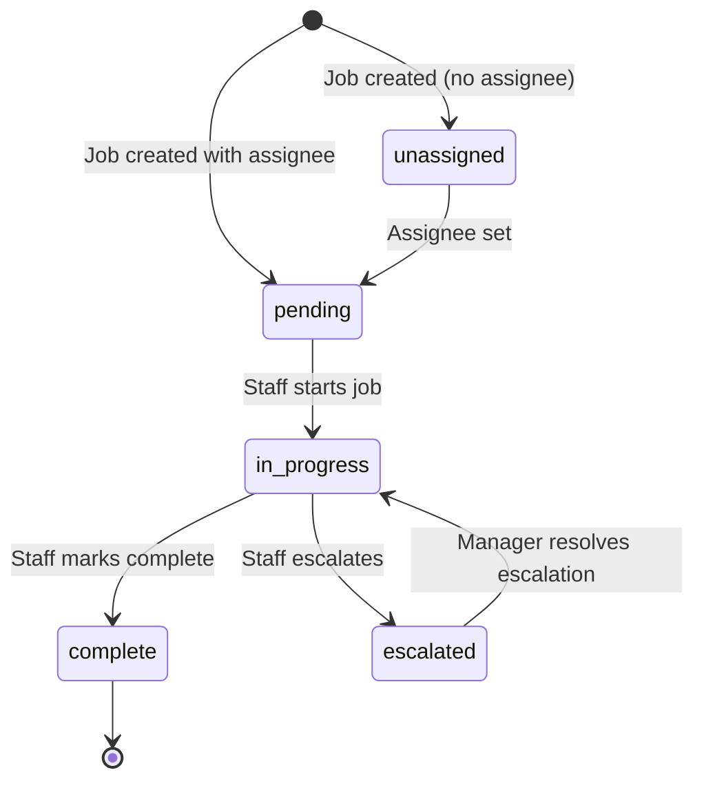
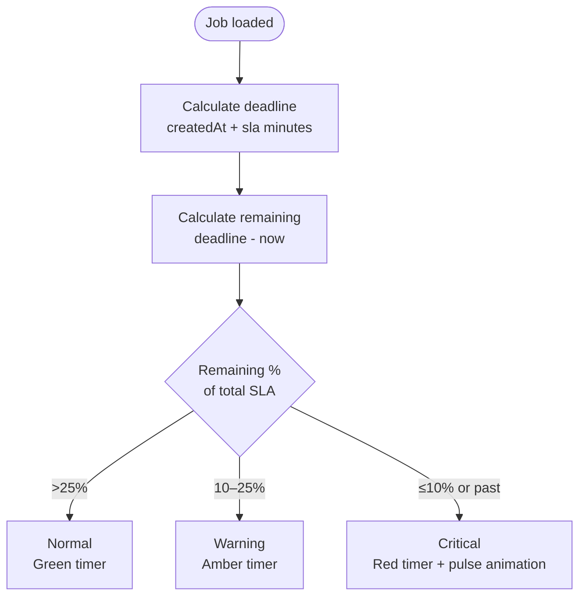
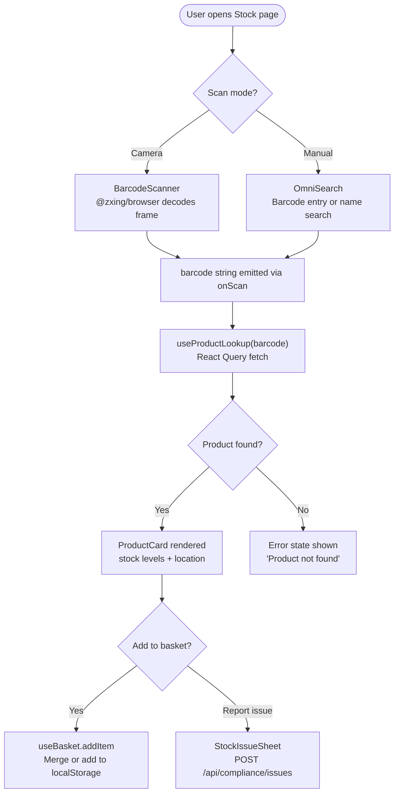
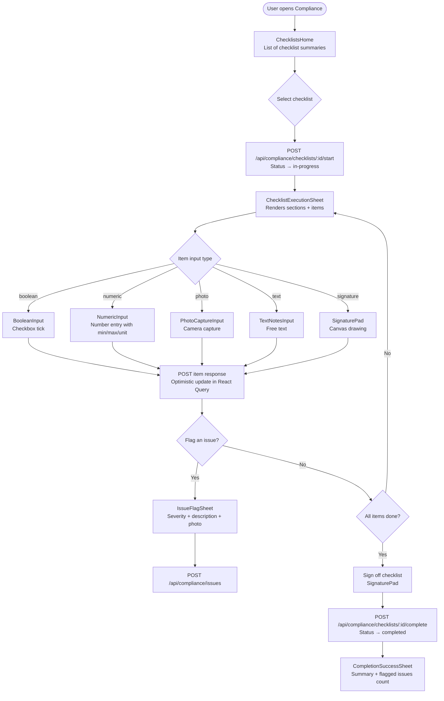
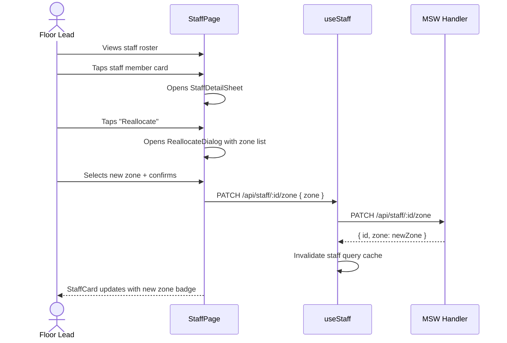

# Technical Design Document — Primark Pulse.ai

**Version:** 1.0
**Date:** 2026-02-25
**Source:** Reverse-engineered from codebase

---

## 1. Purpose

Primark Pulse.ai is a Proof of Concept (PoC) store operations platform demonstrating that Primark's fragmented, manual in-store processes can be unified in a single mobile PWA. The system proves the interaction model and visual design for 8 operational modules, with 2 (Stock and Compliance) implemented end-to-end with real client-side logic. The architecture is deliberately structured to make the transition from mocked API data to a real backend seamless.

---

## 2. Technical Architecture Decisions

| Decision | Choice | Rationale (inferred) |
|----------|--------|----------------------|
| Frontend framework | React 18 + TypeScript | Component-based UI, strong typing, large ecosystem, and team familiarity implied by code structure |
| Build tool | Vite | Fast HMR, native ESM, excellent PWA plugin ecosystem |
| API mocking | Mock Service Worker (MSW) | Intercepts real `fetch()` calls at service worker level; app code is identical to production — no mock-specific code in components |
| Server state | TanStack Query v5 | Declarative caching, staleTime, optimistic updates, and automatic refetch without boilerplate |
| Global state | Zustand | Minimal boilerplate for auth, UI, and basket state; `persist` middleware for localStorage with zero configuration |
| Styling | Tailwind CSS + shadcn/ui | Utility-first, mobile-responsive; shadcn/ui provides accessible Radix UI components with full customisability |
| PWA | vite-plugin-pwa (Workbox) | Auto-generates service worker and manifest; `autoUpdate` registration ensures users always have the latest version |
| Barcode scanning | @zxing/browser | Client-side barcode decoding; no server round-trip required; works with device rear camera via `getUserMedia` |
| Offline basket | Zustand persist → localStorage | Simple key-value persistence for the replenishment basket without needing IndexedDB complexity |
| Routing | React Router v6 | Nested routes, lazy loading via `React.lazy`, declarative protected route pattern |

---

## 3. API / Interface Specification

All endpoints are currently handled by MSW (`src/mocks/handlers.ts`). In production, the same paths would be served by a real backend.

### Authentication

| Method | Path | Description | Auth required |
|--------|------|-------------|---------------|
| POST | `/api/auth/login` | Authenticate with email + password; returns user object and JWT token | No |
| POST | `/api/auth/logout` | Invalidate session | Yes |

### Store Overview

| Method | Path | Description | Auth required |
|--------|------|-------------|---------------|
| GET | `/api/store/metrics` | Returns StoreMetrics (staff active, tills open, open tasks, compliance %) | Yes |
| GET | `/api/alerts` | Returns Alert[] ordered by timestamp | Yes |
| GET | `/api/ai/suggestion` | Returns current AISuggestion | Yes |
| POST | `/api/ai/suggestion/:id/dismiss` | Dismiss an AI suggestion | Yes |
| GET | `/api/store/pressure` | Returns PressureIndicator with level and peak forecast | Yes |

### Staff

| Method | Path | Description | Auth required |
|--------|------|-------------|---------------|
| GET | `/api/staff/me` | Returns the current user's shift and zone info | Yes |
| GET | `/api/staff?zone=` | Returns StaffMember[]; optional `zone` filter | Yes |
| PATCH | `/api/staff/:id/zone` | Reallocate a staff member to a new zone | Yes |

### Jobs

| Method | Path | Description | Auth required |
|--------|------|-------------|---------------|
| GET | `/api/jobs?filter=` | Returns Job[]; filter: `all`, `my-jobs`, `unassigned` | Yes |
| POST | `/api/jobs` | Create a new job | Yes |
| PATCH | `/api/jobs/:id` | Update job status, assignee, or other fields | Yes |
| POST | `/api/jobs/:id/escalate` | Escalate a job with reason and escalation target | Yes |

### Tasks (legacy)

| Method | Path | Description | Auth required |
|--------|------|-------------|---------------|
| GET | `/api/tasks?filter=` | Returns Task[]; filter: `all`, `my-tasks`, `unassigned` | Yes |
| POST | `/api/tasks` | Create a new task | Yes |
| PATCH | `/api/tasks/:id` | Update task status or assignee | Yes |

### Products & Stock

| Method | Path | Description | Auth required |
|--------|------|-------------|---------------|
| GET | `/api/products/:barcode` | Look up a product by barcode; returns Product or 404 | Yes |
| POST | `/api/replenishment` | Submit replenishment basket; returns request ID | Yes |

### Compliance

| Method | Path | Description | Auth required |
|--------|------|-------------|---------------|
| GET | `/api/compliance/checklist` | Legacy: returns flat ChecklistItem[] | Yes |
| PATCH | `/api/compliance/checklist/:id` | Toggle a legacy checklist item | Yes |
| POST | `/api/compliance/policy-search` | GenAI policy search; returns PolicySearchResult | Yes |
| GET | `/api/compliance/checklists` | Returns ChecklistSummary[] for all checklists | Yes |
| GET | `/api/compliance/checklists/:id` | Returns full Checklist with sections and items | Yes |
| POST | `/api/compliance/checklists/:id/start` | Start a checklist; sets status to `in-progress` | Yes |
| POST | `/api/compliance/checklists/:checklistId/items/:itemId` | Submit a response to a checklist item | Yes |
| POST | `/api/compliance/checklists/:id/complete` | Complete checklist with optional digital signature | Yes |
| POST | `/api/compliance/issues` | Report a flagged issue against a checklist item | Yes |
| GET | `/api/compliance/incidents` | Returns IncidentReport[] | Yes |
| POST | `/api/compliance/incidents` | File a new incident report | Yes |

### Queues

| Method | Path | Description | Auth required |
|--------|------|-------------|---------------|
| GET | `/api/queues` | Returns QueueStatus[] for all monitored queue points | Yes |

### Messages

| Method | Path | Description | Auth required |
|--------|------|-------------|---------------|
| GET | `/api/messages?filter=&zone=` | Returns Message[] filtered by scope and zone | Yes |
| GET | `/api/messages/:id` | Returns a single Message with full acknowledgment list | Yes |
| POST | `/api/messages/:id/acknowledge` | Record a user's acknowledgment of a message | Yes |
| POST | `/api/messages` | Compose and send a new message | Yes |

### Schedule

| Method | Path | Description | Auth required |
|--------|------|-------------|---------------|
| GET | `/api/schedule` | Returns ScheduledShift[] for the current user | Yes |
| GET | `/api/schedule/available` | Returns AvailableShift[] offered by colleagues | Yes |
| POST | `/api/schedule/offer/:shiftId` | Offer a shift for swap | Yes |
| POST | `/api/schedule/accept/:shiftId` | Accept an available swap shift | Yes |
| DELETE | `/api/schedule/offer/:shiftId` | Withdraw a shift offer | Yes |

---

## 4. Key Workflows

### 4.1 Job Lifecycle

**Steps:**
1. A job is created by a manager/floor lead (or AI-suggested) with priority, zone, SLA, and optional assignee.
2. If no assignee, status is `unassigned` and the job appears in the "Unassigned" filter.
3. Assigning a staff member transitions the job to `pending`.
4. Staff member starts the job — status becomes `in-progress`.
5. Staff member completes the job — status becomes `complete`, `completedAt` and `completedIn` are recorded.
6. Alternatively, staff escalates: an `EscalationInfo` object is attached and status becomes `escalated`.

---

### 4.2 SLA Timer Calculation

**Source:** `src/hooks/useTasks.ts:136–150`

---

### 4.3 Barcode Stock Lookup

---

### 4.4 Compliance Checklist Flow

---

### 4.5 Staff Reallocation

---

## 5. Error Handling

- **API errors:** React Query `isError` state triggers error UI within each page/component. For example, product lookup renders an "Unable to find product" card on 404. — `src/pages/Stock/components/ProductCard.tsx`
- **Optimistic update rollback:** Checklist item toggle and task update hooks snapshot previous state before mutation and restore it on API failure. — `src/hooks/useChecklist.ts:56`, `src/hooks/useTasks.ts:100`
- **Toast notifications:** `toastStore` and `ToastContainer` (`src/components/ui/toast.tsx`) provide dismissible toast messages for action confirmations and errors; auto-dismiss after 3 seconds.
- **Form validation:** Zod schemas (via React Hook Form resolvers) validate form inputs client-side before submission.
- **Loading states:** All data-fetching pages render skeleton screens (`src/components/ui/skeleton.tsx`) while queries are in flight.

---

## 6. Security Considerations

- **Auth persistence:** The JWT token is stored in `localStorage` (via Zustand persist). In production this creates XSS exposure risk — a `httpOnly` cookie strategy would be preferable.
- **Credential validation:** The PoC accepts any email/password combination — `src/pages/Login/LoginPage.tsx:28`. Production must implement real credential validation.
- **RBAC not enforced:** Three roles (`staff`, `floor-lead`, `manager`) are defined and stored on the user object, but no route guards or component-level permission checks enforce role-based access. All authenticated users see all pages.
- **No HTTPS enforcement:** The Vite dev server runs on HTTP; production deployment must enforce HTTPS for service worker and camera access (`getUserMedia` requires secure context).
- **Camera permissions:** Camera access is requested lazily (only when the scanner is opened), reducing permission fatigue. — `src/pages/Stock/components/BarcodeScanner.tsx`

---

## 7. Performance Considerations

- **Code splitting:** All 10 page components are lazy-loaded via `React.lazy` / `Suspense` — `src/App.tsx:10–19`. Initial bundle only includes the shell and router.
- **React Query caching:**  Default `staleTime` of 5 minutes prevents redundant API calls. Product lookups additionally cache for 5 minutes with `retry: false` to avoid hammering the API on not-found barcodes. — `src/hooks/useProductLookup.ts:17`
- **Auto-refresh:** Task list polls every 30 seconds (`refetchInterval: 30000`) to simulate live data without WebSocket complexity. — `src/hooks/useTasks.ts:71`
- **Optimistic UI:** Task and checklist mutations update the UI immediately before the API response, giving instant feedback on slow connections. — `src/hooks/useTasks.ts:100`, `src/hooks/useChecklist.ts:51`
- **Workbox NetworkFirst caching:** API responses are served from network first, with a 24-hour cache fallback — ensures the app remains usable in poor connectivity without serving stale data when online.
- **Skeleton screens:** `SkeletonMetricCard` and `SkeletonCard` components prevent layout shift during initial page loads.
- **PWA asset caching:** All `js`, `css`, `html`, `ico`, `png`, `svg`, and `woff2` assets are pre-cached by the service worker at install time.

---

## 8. State Management Architecture

| State Type | Solution | Location | Example |
|------------|----------|----------|---------|
| Server state | React Query | `src/hooks/*.ts` | Tasks, staff roster, products, checklists |
| Authenticated user | Zustand + persist | `src/stores/authStore.ts` | User email, name, role, token |
| Global UI state | Zustand | `src/stores/uiStore.ts` | Active nav, notification count, modal, toast |
| Replenishment basket | Zustand + persist | `src/hooks/useBasket.ts` | Basket items persisted to localStorage |
| Local component state | `useState` | Individual pages/components | Scan mode, selected product, quantity, sheet open/closed |

---

## 9. Known Limitations and Technical Debt

- **Dual task/job types:** Both `Task` (`src/types/index.ts:71`) and `Job` (`src/types/index.ts:19`) entities exist with near-identical structures. The `Job` type is richer and appears to be the intended replacement; the `Task` type and its page (`/tasks`, not in main nav) appear to be a legacy artefact. The `TasksPage` route exists in `src/App.tsx` but is not in the bottom navigation.
- **Tasks route not in nav:** `/tasks` is defined in the router but not accessible from the bottom navigation bar. — `src/components/custom/bottom-nav.tsx`
- **Hardcoded current user:** Policy search and checklist completion hardcode "Current User" as the completing staff member rather than reading from `authStore`. — `src/hooks/useChecklist.ts:48`
- **In-memory message mutation:** Message acknowledgments are pushed directly onto the mock array (`mockMessages.unshift`, `message.acknowledgments.push`) — acceptable for PoC but would lose data on page refresh. — `src/mocks/handlers.ts:349`
- **No real AI integration:** The `POST /api/ai/suggestion/:id/dismiss` endpoint returns `{ success: true }` but the suggestion still appears on next load; the AI banner dismissal is not persisted between sessions.
- **MSW always enabled:** `main.tsx:19` enables MSW in all environments including production builds (`// enabled in all environments for PoC`). This must be gated to development-only before production deployment.
- **Mock auth bypass:** `LoginPage.tsx:28` bypasses the `/api/auth/login` endpoint entirely and calls `setAuth()` directly with hardcoded user data, meaning the MSW login handler is never exercised.

---

## 10. Future Enhancements (identified from code)

- **Real backend API:** Replace MSW handlers with a real REST or GraphQL API; the `src/lib/api.ts` pattern described in the specification (`misc/primark-pulse-specification.md:449`) is ready to adopt.
- **WebSocket / real-time updates:** Replace 30-second polling with Supabase Realtime or Socket.io subscriptions for truly live dashboards — `misc/primark-pulse-specification.md:390`.
- **RBAC enforcement:** Implement role-based route guards and component-level permission checks using the existing `UserRole` type.
- **Insights page:** `src/pages/Insights/InsightsPage.tsx` exists as a placeholder — full implementation would include performance analytics, timeline playback, and sentiment signals.
- **Tasks/Jobs consolidation:** Merge the `Task` and `Job` entities and remove the orphaned `/tasks` route.
- **Push notifications:** Implement Web Push via service worker for real-time alerts even when the app is in the background.
- **State Tasks API integration:** Staff reallocations, job completions, and message sends currently mutate in-memory state only — pending database persistence in production.
