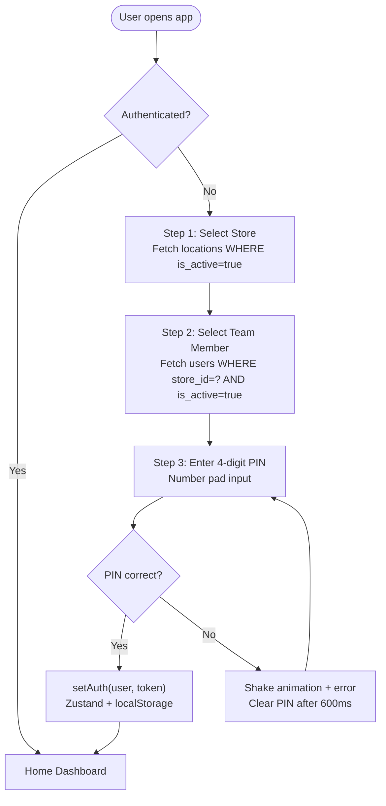
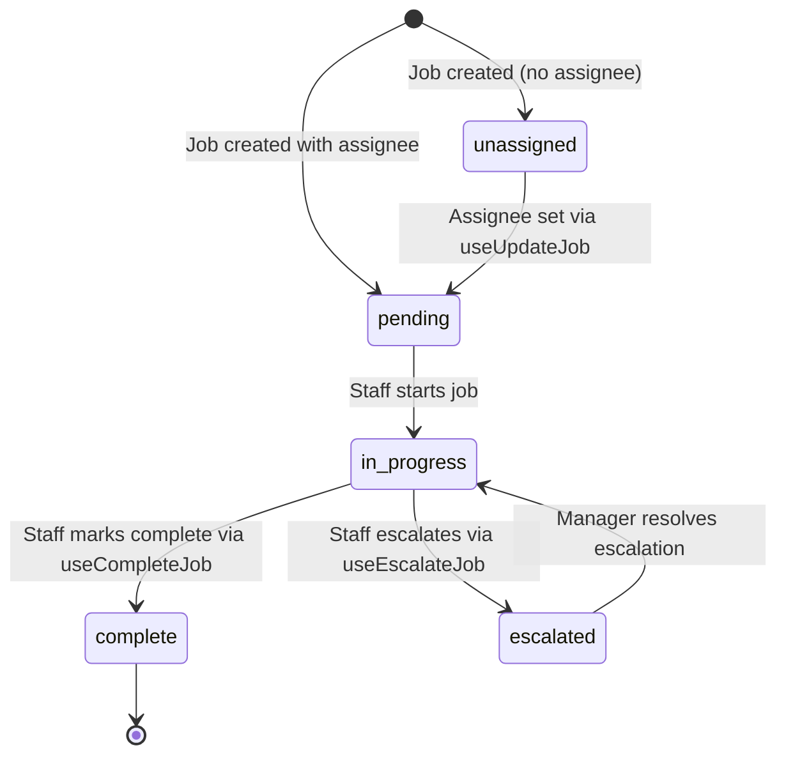
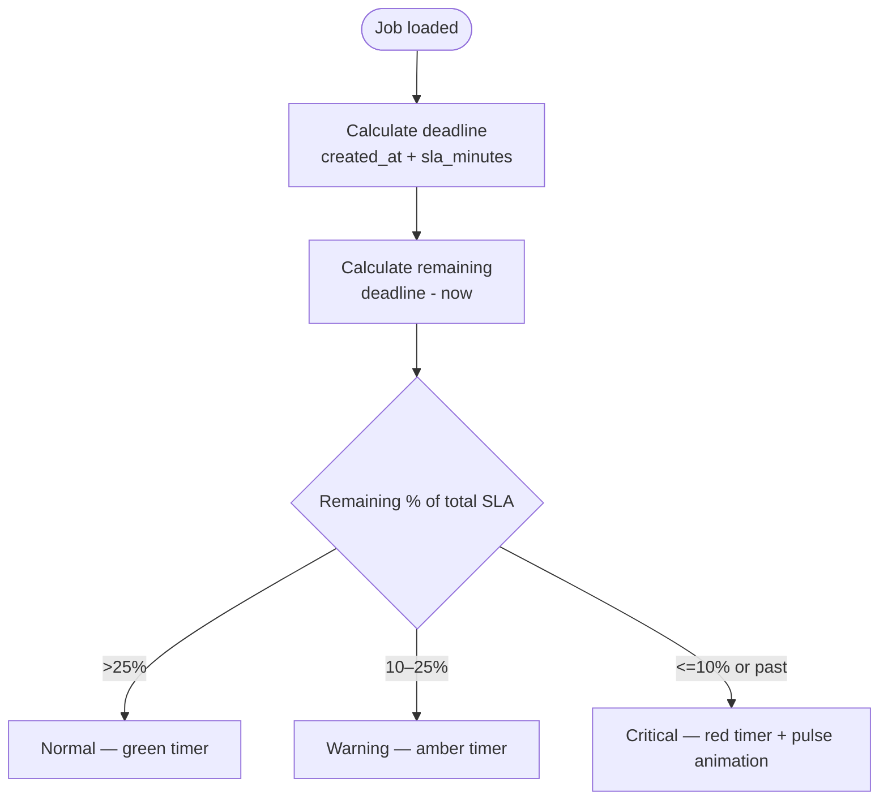
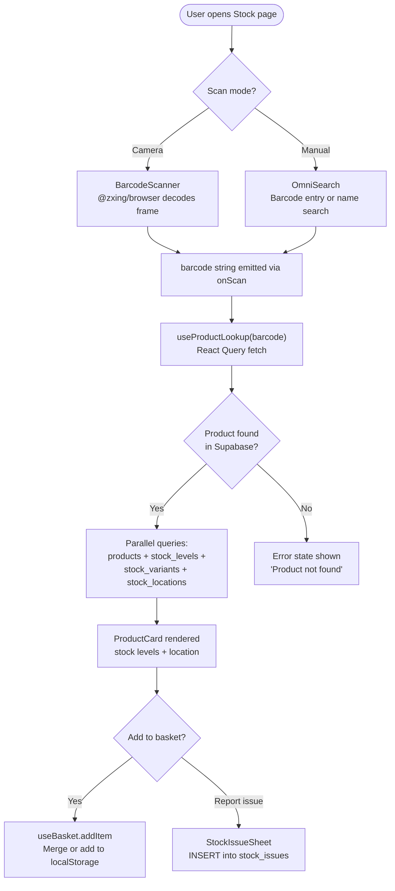
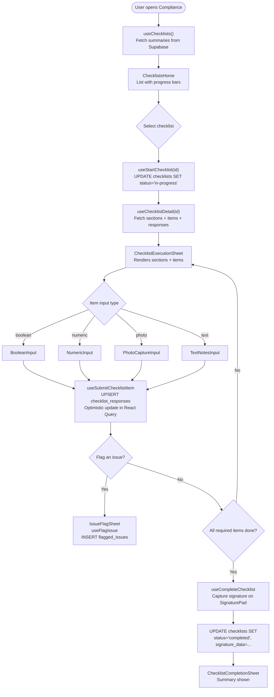
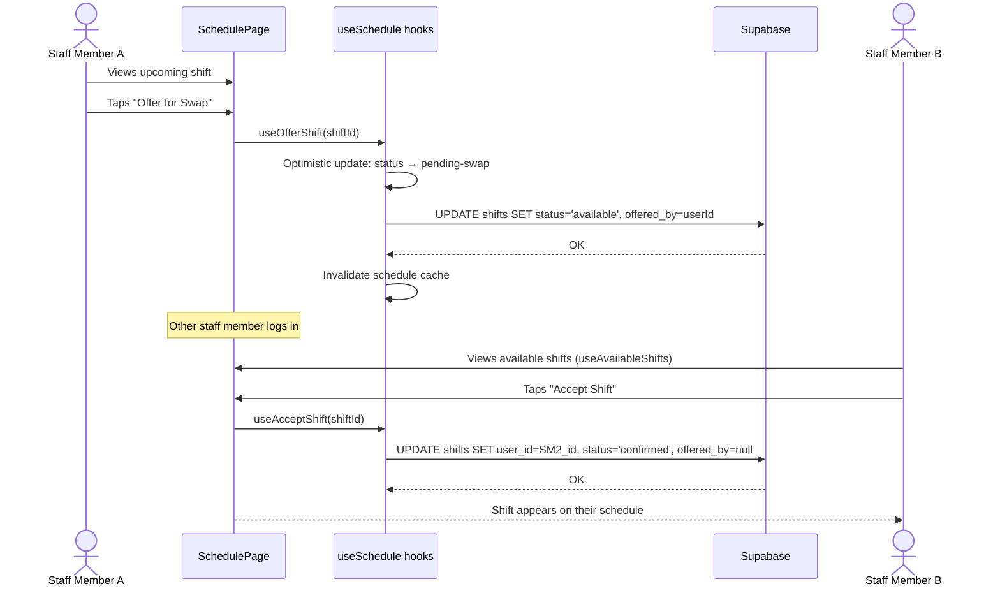

# Technical Design Document — Primark Pulse

**Version:** 2.0
**Date:** 2026-02-27
**Source:** Reverse-engineered from codebase

---

## 1. Purpose

Primark Pulse is a Proof of Concept store operations platform demonstrating that Primark's fragmented, manual in-store processes can be unified in a single mobile PWA. The system is fully wired to a live Supabase PostgreSQL backend for all operational modules. MSW is still initialised at startup but all custom hooks bypass it by calling Supabase directly, meaning the architecture is already production-like. The remaining gap to a production system is primarily RBAC enforcement, hashed PINs, and RLS policies.

---

## 2. Technical Architecture Decisions

| Decision | Choice | Rationale (inferred) |
|----------|--------|----------------------|
| Frontend framework | React 18 + TypeScript | Component-based UI, strong typing, large ecosystem |
| Build tool | Vite | Fast HMR, native ESM, excellent PWA plugin ecosystem |
| Backend / BaaS | Supabase (PostgreSQL) | Hosted Postgres with REST API, no custom backend required for PoC |
| Auth | Custom PIN via Supabase query | No Supabase Auth used — PIN compared in-browser against `users.pin` column |
| Server state | TanStack Query v5 | Declarative caching, staleTime, optimistic updates, refetch intervals |
| Global state | Zustand | Minimal boilerplate for auth, UI, and basket state; `persist` middleware for localStorage |
| Styling | Tailwind CSS + shadcn/ui | Utility-first, mobile-responsive; accessible Radix UI components with full customisability |
| PWA | vite-plugin-pwa (Workbox) | Auto-generates service worker and manifest; `autoUpdate` registration |
| Barcode scanning | @zxing/browser | Client-side barcode decoding via `getUserMedia`; no server round-trip required |
| Offline basket | Zustand persist → localStorage | Simple key-value persistence without needing IndexedDB complexity |
| Routing | React Router v6 | Nested routes, lazy loading via `React.lazy`, declarative protected route pattern |
| Legacy mocking | MSW (bypassed) | Still initialised with `onUnhandledRequest: 'bypass'`; hooks no longer route through it |

---

## 3. Database Interface

All data access goes through the **Supabase JS client** (`src/lib/supabase.ts`), which communicates via Supabase's auto-generated REST API over HTTPS. There are no custom backend endpoints.

**Pattern:**

```ts
// Every hook reads storeId from the auth store
const storeId = useAuthStore(s => s.user?.store_id)

// All queries filter by store_id for tenant isolation
const { data, error } = await supabase
  .from('jobs')
  .select('*, zones(name), staff_members(id, users(name))')
  .eq('store_id', storeId!)
  .order('created_at', { ascending: false })
```

**React Query key convention:** `[resourceName, storeId, ...filters]`
Example: `['jobs', storeId, 'unassigned']` — `src/hooks/useJobs.ts:43`

**Mutations use optimistic updates** where appropriate (jobs, checklist responses) with rollback on failure.

---

## 4. Key Workflows

### 4.1 Login Flow (3-step PIN)



**Steps:**
1. On mount, `LoginPage` fetches `locations` from Supabase; user selects their store
2. App fetches `users` for the selected store; user selects their name
3. User enters 4-digit PIN via on-screen number pad
4. On 4th digit, app queries `users.pin` for the selected user and compares in-browser
5. On match: `setAuth({ id, name, store, store_id, role }, 'supabase-session-' + Date.now())` is called; user is redirected to `/`
6. On mismatch: 600ms shake animation, PIN cleared, error message shown

---

### 4.2 Job Lifecycle



**Steps:**
1. A job is created via `useCreateJob` with priority, zone, SLA, optional assignee
2. If no assignee, status = `unassigned`; assigning transitions to `pending`
3. `useCompleteJob` sets `status = 'complete'`, records `completed_at` and `completed_in`
4. `useEscalateJob` inserts a row in `escalations` and sets job `status = 'escalated'`
5. Top jobs are scored by a composite algorithm: 40% priority weight + 40% SLA urgency + 20% time-of-day zone relevance — `src/hooks/useJobs.ts:261`

---

### 4.3 SLA Timer Calculation



**Source:** `src/hooks/useJobs.ts:290`

---

### 4.4 Barcode Stock Lookup



---

### 4.5 Compliance Checklist Flow



---

### 4.6 Shift Swap Flow



---

## 5. Error Handling

- **Supabase errors:** All hooks check `if (error) throw error` after each Supabase call; React Query `isError` state triggers error UI within each component
- **Optimistic update rollback:** Jobs (`useUpdateJob`) and checklist responses (`useSubmitChecklistItem`) snapshot previous state before mutation and restore it on API failure
- **Toast notifications:** `toastStore` and `ToastContainer` (`src/components/ui/toast.tsx`) provide dismissible toast messages for confirmations and errors; auto-dismiss after 3 seconds
- **Form validation:** Zod schemas (via React Hook Form resolvers) validate form inputs client-side before submission
- **Loading states:** All data-fetching pages render skeleton screens while queries are in flight
- **PIN error:** Wrong PIN triggers a 600ms shake animation, clears the PIN, and shows an inline error message — `src/pages/Login/LoginPage.tsx:107`

---

## 6. Security Considerations

- **Auth persistence:** A synthetic token string (`'supabase-session-' + Date.now()`) is stored in `localStorage` via Zustand persist. This is not a real JWT — in production, use Supabase Auth sessions with `httpOnly` cookie storage
- **PIN storage:** PINs are stored as plain text in `users.pin`. In production, use a hash (e.g., bcrypt)
- **In-browser PIN comparison:** The raw PIN is fetched from Supabase and compared in the browser — `src/pages/Login/LoginPage.tsx:87`. In production, PIN comparison must happen server-side
- **RLS disabled:** Row Level Security is disabled on all Supabase tables for PoC (`supabase/schema.sql:10`). Production must enable RLS policies
- **RBAC not enforced:** Three roles (`staff`, `floor-lead`, `manager`) are defined and stored on the user object, but no route guards or component-level permission checks enforce role-based access
- **HTTPS required:** Camera access via `getUserMedia` requires a secure context; production deployment must enforce HTTPS
- **Supabase anon key:** The anon key is embedded in the client bundle via `VITE_SUPABASE_ANON_KEY`. RLS must be enabled in production to prevent unauthorised direct table access

---

## 7. Performance Considerations

- **Code splitting:** All 11 page components are lazy-loaded via `React.lazy` / `Suspense` — `src/App.tsx:10–20`. Initial bundle only includes the shell and router
- **React Query caching:** Default `staleTime` of 5 minutes prevents redundant Supabase queries. Product lookups cache for 5 minutes with `retry: false` — `src/hooks/useProductLookup.ts:63`
- **Auto-refresh:** Store metrics and job list poll every 30 seconds (`refetchInterval: 30000`) to keep dashboards live — `src/hooks/useStoreMetrics.ts:89`, `src/hooks/useJobs.ts:82`
- **Alert polling:** Alerts refetch every 15 seconds — `src/hooks/useAlerts.ts:33`
- **Optimistic UI:** Job and checklist mutations update the UI immediately before the Supabase response, giving instant feedback on slow connections
- **Workbox NetworkFirst caching:** API responses are served from network first, with a 24-hour cache fallback
- **Skeleton screens:** `SkeletonCard` components prevent layout shift during initial page loads
- **Parallel queries:** `useStoreMetrics` runs 4 Supabase queries in parallel via `Promise.all` — `src/hooks/useStoreMetrics.ts:12`

---

## 8. State Management Architecture

| State Type | Solution | Location | Example |
|------------|----------|----------|---------|
| Server state | React Query | `src/hooks/*.ts` | Jobs, staff roster, products, checklists |
| Authenticated user | Zustand + persist | `src/stores/authStore.ts` | User id, name, store_id, role — localStorage |
| Global UI state | Zustand | `src/stores/uiStore.ts` | Active nav, notification count, modal, toast |
| Replenishment basket | Zustand + persist | `src/hooks/useBasket.ts` | Basket items persisted to localStorage |
| Local component state | `useState` | Individual pages/components | Scan mode, selected product, quantity, sheet open/closed, PIN digits |

---

## 9. Known Limitations and Technical Debt

- **MSW still initialised:** `src/main.tsx:29` starts MSW in all environments (`onUnhandledRequest: 'bypass'`). MSW no longer affects data flow but it starts a service worker on every load. Should be removed or gated to development-only before production
- **In-browser PIN comparison:** PIN is fetched from Supabase and compared client-side — a security vulnerability in production that requires server-side verification
- **Plain text PINs:** `users.pin` stores PINs as plain text. Production must hash PINs (e.g., bcrypt) and use a server-side comparison function
- **RLS disabled:** Row Level Security is disabled on all tables in `supabase/schema.sql`. Production must enable per-table RLS policies scoped to `store_id`
- **RBAC not enforced:** User roles are stored but no route guards or component-level guards enforce them — all authenticated users see all screens
- **`store_id` field added mid-development:** Auth store version was bumped from 0 to 1 to force re-login for sessions that predate the `store_id` field — `src/stores/authStore.ts:44`
- **Legacy Tasks entity:** Both `tasks` and `jobs` tables/entities exist with near-identical structures. The `/tasks` route is defined in `src/App.tsx` but not accessible from the bottom navigation. `useJobs` is the active hook; `useTasks` is a legacy artefact
- **`useStoreMetrics` bypasses `store_metrics` table:** The hook computes metrics on-the-fly from 4 live tables rather than using the pre-computed `store_metrics` table. The table exists in the schema but is currently unused by the hook
- **`tillsOpen`/`tillsTotal` hard-coded:** Both fields in `StoreMetrics` are returned as `0` — tills monitoring is not yet implemented — `src/hooks/useStoreMetrics.ts:80`
- **Policy search mocked:** `usePolicySearch` still returns mock responses (AI feature not wired to a real LLM) — `src/hooks/usePolicySearch.ts`
- **AI suggestion mock:** `useAISuggestion` reads from the `ai_suggestions` table in Supabase but the suggestions themselves are seed data, not generated by a real AI model

---

## 10. Future Enhancements (identified from code)

- **Supabase Auth:** Replace PIN + Zustand with `supabase.auth` (magic link or OTP) for proper session management and server-side identity
- **RLS enforcement:** Enable Supabase Row Level Security policies on all tables, scoped to `auth.uid()` and `store_id`
- **RBAC enforcement:** Implement role-based route guards using the existing `UserRole` type and enforce component-level permission checks
- **WebSocket / real-time updates:** Replace polling intervals with Supabase Realtime subscriptions (`supabase.channel()`) for truly live job and alert feeds
- **Insights page:** `src/pages/Insights/InsightsPage.tsx` exists as a placeholder — full implementation would include performance analytics, timeline playback, and sentiment signals
- **Tasks/Jobs consolidation:** Merge the `Task` entity into `Job` and remove the orphaned `/tasks` route and `tasks` table
- **Server-side PIN comparison:** Implement a Supabase Edge Function to verify PINs server-side and issue a real JWT
- **Push notifications:** Implement Web Push via service worker for real-time alerts when the app is in the background
- **Tills monitoring:** Implement `tillsOpen`/`tillsTotal` from a real tills data source
- **Real AI integration:** Replace seed-data AI suggestions with a real LLM integration for dynamic suggestions and genuine policy search
